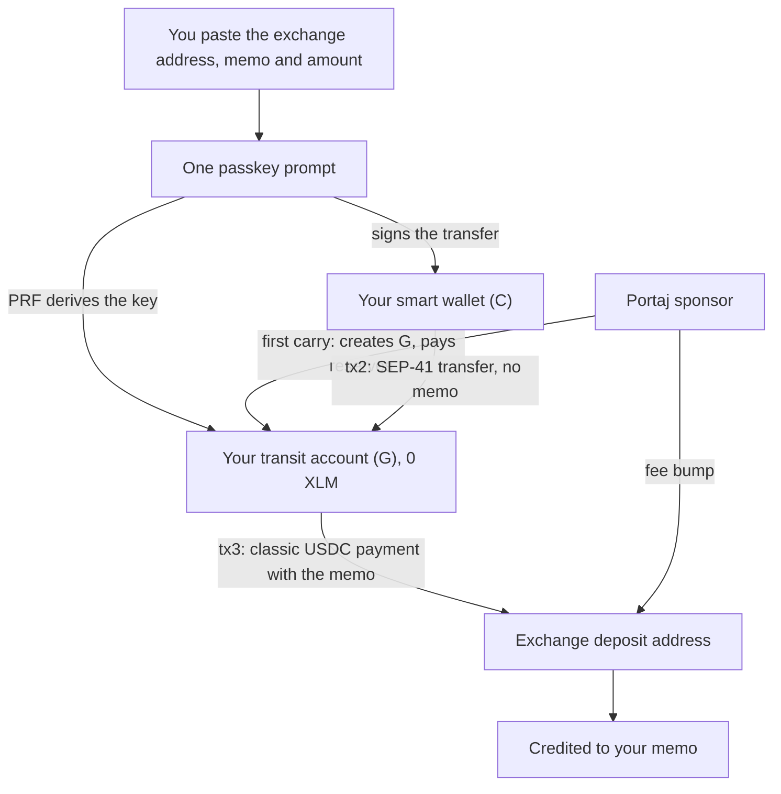
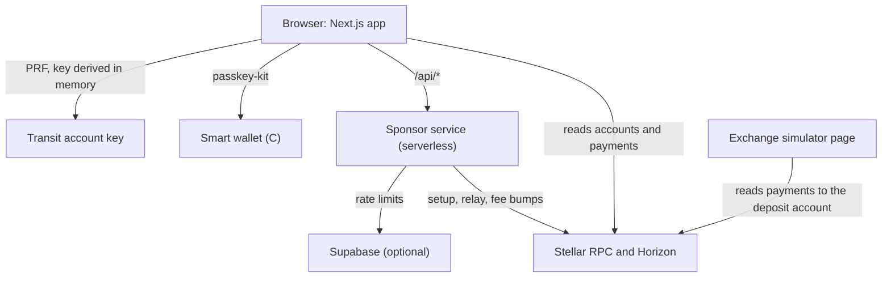

<p>
  
</p>

# Portaj

The exit route for Stellar smart wallets.

You hold USDC in a passkey smart wallet (a C-address) and want it on an exchange. The exchange shows a Stellar deposit address and a memo, and your wallet can't send to it: the network refuses a memo on a contract call, and exchanges don't credit contract transfers anyway. Portaj carries the USDC across. It moves it into your own Stellar account, derived from your passkey and created with sponsored reserves, then pays the exchange from there as a classic payment with the memo. You need no XLM and no seed phrase, and one passkey prompt does it.

**[Open the app](https://portaj.vercel.app/app)** · **[Landing page](https://portaj.vercel.app)** · **[How it works](https://portaj.vercel.app/how)** · **[An example carry on stellar.expert](https://stellar.expert/explorer/testnet/tx/47cf0d749698ccc1c98d54b1f9c44ae64bbe55cdab8f513fcdf3dbe166ba1102)** · **[Decisions](DECISIONS.md)**

> Portaj runs on Stellar **testnet**. No real exchange runs on testnet, so the app ships a clearly labelled exchange simulator that credits deposits the way SDF documents real exchanges do. Portaj isn't affiliated with the Stellar Development Foundation or Circle. It never holds your keys or your funds; the only key on its server is the sponsor's, which pays reserves and fees and can't move your money.

Built for the Find Your Way hackathon (Stellar Passport), General Track.

## Contents

- [Status](#status)
- [Why Portaj](#why-portaj)
- [How a carry works](#how-a-carry-works)
- [The sponsor's rules](#the-sponsors-rules)
- [Receipts and checking them yourself](#receipts-and-checking-them-yourself)
- [Architecture](#architecture)
- [Testnet addresses](#testnet-addresses)
- [Evidence](#evidence)
- [Security model](#security-model)
- [Run it yourself](#run-it-yourself)
- [Repository map](#repository-map)
- [Documentation](#documentation)
- [What Portaj does not do yet](#what-portaj-does-not-do-yet)

## Status

Checked on 9 October 2026. Every row links to evidence a reviewer can check or rerun.

| Part | State | Evidence |
| --- | --- | --- |
| Web app | Live at [portaj.vercel.app](https://portaj.vercel.app). The app has four screens: Wallet, Carry, Receipts and Exchange. It covers passkey sign-in, the carry flow, the "normal way" rejection beside it, receipts, recovery, and light and dark themes. | `src/app/` |
| Sponsor service | Live as serverless routes on the same deployment. It signs only the transaction shapes listed under [the sponsor's rules](#the-sponsors-rules). It holds 6,394 testnet XLM and sponsors 12 ledger entries | `src/lib/server/sponsor.ts`, `src/app/api/` |
| End-to-end flow | **16 of 16 checks passed against the live URL** in 116 seconds. Each run uses real testnet transactions and a virtual passkey with PRF. | `e2e/live.mjs` |
| Exchange simulator | Live. Its deposit account sets `config.memo_required = 1` (SEP-29), and the simulator credits only classic USDC payments that carry a memo. | [/app/exchange](https://portaj.vercel.app/app/exchange) |
| Test USDC | A stash of 3,279 Circle testnet USDC. It hands 25 USDC to each new test wallet. | `scripts/setup-testnet.mjs`, [D-003](DECISIONS.md) |
| Unit tests | 12 tests covering amounts, addresses, memos and key derivation, including an independent HKDF check. | `src/lib/__tests__/core.test.ts` |
| Mainnet | Not deployed. Network settings live in one file, and the simulator and test tools hide off testnet. A mainnet deploy also needs its own sponsor, the mainnet USDC issuer and passphrase | `src/lib/config.ts` |

## Why Portaj

A transfer out of a smart wallet is a contract call, and stellar-core refuses any memo on one ([`TransactionFrame::validateSorobanMemo`](https://github.com/stellar/stellar-core/blob/ba6a4e6e322a8069b85bdf48a35d971a2d72cc81/src/transactions/TransactionFrame.cpp)). Over RPC, simulation answers `Transaction contains a memo. Soroban transactions do not support memos.` and submission fails with `txMalformed` (-16). Drop the memo and the transfer lands, but SDF's [smart-wallet docs](https://developers.stellar.org/docs/build/apps/smart-wallets) say it plainly: "transfers from contracts are not supported by exchanges today".

The usual workaround is a classic wallet. That needs XLM for the account reserve and the USDC trustline before it can hold USDC, and the place to buy XLM is the exchange you can't reach ([stellar-protocol #1956](https://github.com/stellar/stellar-protocol/discussions/1956)). It also hands a passkey user a seed phrase for a single withdrawal.

> With Portaj, a smart-wallet user's USDC cannot be stranded for lack of a memo, a trustline or XLM.

Three Stellar features make that possible without a contract of Portaj's own:

- **Sponsored reserves (CAP-33).** The sponsor creates your transit account with 0 XLM and pays for its USDC trustline, so you never buy XLM.
- **Fee bumps (CAP-15).** Your transit account signs its own payment, and the sponsor pays the fee by wrapping it.
- **WebAuthn PRF.** The same passkey always gives the same Stellar key, computed in your browser. There is no seed phrase and nothing to store.

## How a carry works



1. **Sign in with a passkey.** On testnet, Wallet creates a passkey-kit smart wallet (v0.17.0 WASM) and Portaj pays the deployment. Your wallet lives on another site? Choose *Another wallet* on Carry; passkeys belong to the site that made them, so you send from there.
2. **Paste the exchange's address and memo.** Portaj checks the address exists and can receive USDC, reads its SEP-29 `memo_required` flag, refuses a C-address, decodes an M-address's muxed ID, and validates the amount to 7 decimals.
3. **Your transit account is derived.** WebAuthn PRF with a fixed salt gives 32 bytes, and HKDF-SHA256 turns them into an ed25519 seed. Same passkey, same G, every time; testnet and mainnet give different accounts.
4. **First carry only: setup (tx1).** The sponsor creates G with 0 XLM and adds the USDC trustline, sponsoring both reserves. G co-signs.
5. **Transfer in (tx2).** Your passkey signs a USDC `transfer(C, G, amount)`, and the sponsor relays it. The same prompt returns the PRF value, so the next step needs no second prompt.
6. **Payment out (tx3).** G pays the exchange a classic USDC payment with the memo, and the sponsor fee-bumps it. USDC sits in G for about one ledger, and G is back to 0 USDC and 0 XLM.

The first carry takes three transactions and two passkey prompts. Every later carry takes two transactions and one prompt ([D-004](DECISIONS.md)).

## The sponsor's rules

The sponsor key is the only key on the server. It signs nothing outside these shapes, and the first failing check refuses the request (`src/lib/server/sponsor.ts`).

| Request | Signed only when | Otherwise |
| --- | --- | --- |
| Setup (tx1) | The target is a valid G address that doesn't exist yet or is already Portaj-sponsored, and the transaction is exactly begin-sponsoring, create-account(0), change-trust(USDC), end-sponsoring | `Not a Portaj setup transaction.` |
| Relay (tx2) | It is one USDC SAC `transfer` from a C-address into an account Portaj sponsors, with no source-account authorization | `Only USDC transfers are relayed.`, `Source-account authorization isn't accepted.` |
| Fee bump (tx3, tx4) | The inner transaction has one operation from a Portaj-sponsored account: a Circle USDC payment out, or a USDC transfer back to the wallet. Its fee is capped | `Only Circle USDC leaves a transit account.`, `That operation isn't part of a carry.` |
| Wallet deploy | It deploys the passkey-kit smart wallet WASM and nothing else | `Only the passkey-kit smart wallet can be deployed.` |
| Test USDC | The target is a smart wallet (C…), at most 3 times a day per wallet | `This wallet already got test USDC today.` |
| Any request | The sponsor holds at least 20 XLM, and the caller is inside its rate limit per IP (and per passkey for setup) | `Portaj's sponsor is low on testnet XLM.` |

Rate limits are counted in Supabase when it's configured, and per serverless instance otherwise ([D-010](DECISIONS.md)). On-chain rules hold either way: one account per derived G, and only accounts the sponsor created get relayed into or fee-bumped.

## Receipts and checking them yourself

Every carry ends on a receipt with three explorer links (setup, transfer in, payment out), the memo exactly as sent, and the transit account read live from Horizon: 0 XLM, reserves sponsored by Portaj. Receipts collects every carry made in that browser. A carry that stopped after the USDC moved shows as unfinished, with **Resume carry** and **Return to my wallet**.

To check the claim yourself on the live app:

1. Open **[Wallet](https://portaj.vercel.app/app)**: press **Create test wallet**, then **Get test USDC**.
2. Open **[Carry](https://portaj.vercel.app/app/carry)** and press **Try the normal way** (right column). The network answers `Transaction contains a memo. Soroban transactions do not support memos.` (simulation) and `txMalformed` (-16) (submission). Nothing moves and no fee is charged.
3. In the left column, choose **Use the exchange simulator's address and memo**, enter an amount and press **Continue with passkey**. The first time, press **Set up (paid by Portaj)**; then **Send**.
4. On stellar.expert, your transit account shows 0 XLM, with account and trustline reserves sponsored by the sponsor below. The payment out carries the memo, goes to the deposit address, and its fee is paid by a fee bump.
5. **[Exchange](https://portaj.vercel.app/app/exchange)** credits it under your memo. A memo-less contract transfer (**Send without the memo**, under the rejection) is listed as not credited.

## Architecture



| Component | What it is | Where |
| --- | --- | --- |
| Wallet screen | The smart wallet's USDC balance and C-address, the transit account card, and on testnet the test wallet and test USDC | `src/app/app/wallet-view.tsx` |
| Carry screen | The form, validation, setup, transfer in, payment out, live step list, receipt, and the "normal way" panel beside it | `src/app/app/carry/carry-view.tsx` |
| Receipts screen | Completed and unfinished carries, the 0 XLM proof, and recovery: resume or return | `src/app/app/receipts/receipts-view.tsx` |
| Exchange simulator | Credits classic USDC payments with a memo, per memo; lists contract transfers and memo-less payments as not credited | `src/app/app/exchange/`, `src/lib/simulator.ts` |
| Key derivation | PRF salt, HKDF-SHA256, ed25519 keypair | `src/lib/derive.ts`, `src/lib/webauthn.ts` |
| Carry steps | Setup, payment out, return, recovery file, one-time key fallback | `src/lib/exit.ts`, `src/lib/txs.ts` |
| Sponsor service | The only server key: setup, relay, fee bump, deploy, test USDC, the naive attempt | `src/lib/server/sponsor.ts`, `src/app/api/` |

Key derivation, in full:

```
salt = SHA-256("portaj:stellar:g-account:v1")          // prf.eval.first, on every ceremony
seed = HKDF-SHA256(ikm = prf.results.first, salt = "portaj",
                   info = "stellar-ed25519-seed:" + hex(SHA-256(networkPassphrase)), 32)
G    = Keypair.fromRawEd25519Seed(seed)
```

| | Source | Operations | Signed by |
| --- | --- | --- | --- |
| tx1 setup (first carry) | Sponsor | `beginSponsoringFutureReserves(G)` · `createAccount(G, 0)` · `changeTrust(USDC)` from G · `endSponsoringFutureReserves` from G | Sponsor + G |
| tx2 transfer in | Sponsor (relay) | `invokeHostFunction`: USDC SAC `transfer(C, G, amount)`, no memo | Passkey signs C's auth entry; sponsor signs the envelope |
| tx3 payment out | G, fee bump by sponsor | `payment(USDC, amount)` to the exchange, memo ID or text | G (inner) + sponsor (fee bump) |
| tx4 return | G, fee bump by sponsor | SAC `transfer(G, C, balance)`, or a USDC payment to a G wallet | G + sponsor |

## Testnet addresses

| | Address |
| --- | --- |
| Sponsor | [GAD3TLO2X27OQROVNDWKBMKZF5XFBMKZMN6GJMX6UAVR2FXSBWO4THCA](https://stellar.expert/explorer/testnet/account/GAD3TLO2X27OQROVNDWKBMKZF5XFBMKZMN6GJMX6UAVR2FXSBWO4THCA) |
| Exchange simulator deposit (`config.memo_required = 1`) | [GCMGLKBKAKL7G6XTSWPQN56MMR4KCSTMNBSSUK3IRAKSJWUA6JV4AYE4](https://stellar.expert/explorer/testnet/account/GCMGLKBKAKL7G6XTSWPQN56MMR4KCSTMNBSSUK3IRAKSJWUA6JV4AYE4) |
| USDC issuer (Circle) | [GBBD47IF6LWK7P7MDEVSCWR7DPUWV3NY3DTQEVFL4NAT4AQH3ZLLFLA5](https://stellar.expert/explorer/testnet/account/GBBD47IF6LWK7P7MDEVSCWR7DPUWV3NY3DTQEVFL4NAT4AQH3ZLLFLA5) |
| USDC SAC | [CBIELTK6YBZJU5UP2WWQEUCYKLPU6AUNZ2BQ4WWFEIE3USCIHMXQDAMA](https://stellar.expert/explorer/testnet/contract/CBIELTK6YBZJU5UP2WWQEUCYKLPU6AUNZ2BQ4WWFEIE3USCIHMXQDAMA) |
| passkey-kit wallet WASM | `97ce047884106b1c6c3bb40b8973cc48db1c4dad95c9e20462bf2c701daa764e` |

Portaj deploys no contract of its own. Every address above is written by `scripts/setup-testnet.mjs` into `src/lib/testnet.json`.

## Evidence

**One carry, on testnet.** This is a first carry for a passkey: 5 USDC to the simulator with memo ID `356409`. It ran through the live app on 9 October 2026.

| Step | Transaction |
| --- | --- |
| Setup: transit account created with 0 XLM and a USDC trustline, reserves sponsored | [`0f0b1e10…`](https://stellar.expert/explorer/testnet/tx/0f0b1e10d4540c08d83e5dd19f8f98e71517a8df74eda01199ea40ae03961413) |
| Transfer in: smart wallet (C) → transit account (G), passkey-signed | [`72fa4bcb…`](https://stellar.expert/explorer/testnet/tx/72fa4bcb6b8531b7fb723f21e8329798d55535c7fb2343fb374174ead69b2a80) |
| Payment out: G → simulator deposit, memo ID `356409`, fee bump by the sponsor | [`47cf0d74…`](https://stellar.expert/explorer/testnet/tx/47cf0d749698ccc1c98d54b1f9c44ae64bbe55cdab8f513fcdf3dbe166ba1102) |
| The transit account afterwards: 0 XLM, 0 USDC, both reserves sponsored | [`GD2VSQSN…`](https://stellar.expert/explorer/testnet/account/GD2VSQSNHIRGIMB5YM6P3AA7T26ANEN7OSMG4HCU6OR3WAUKVFJVY3YO) |

**End-to-end, on the live URL.** `node e2e/live.mjs https://portaj.vercel.app` runs the whole product in real Chrome, with a CDP virtual authenticator that supports PRF and real testnet transactions. The last run passed all 16 checks:

- landing renders
- create a test wallet (2 prompts)
- get test USDC
- the normal way is refused (`txMalformed`)
- without the memo it lands but isn't credited
- first carry with setup, 1 prompt to send
- the transit account holds 0 XLM and 0 USDC with both reserves sponsored
- the simulator credits the memo and not the contract transfer
- a returning carry takes 1 prompt and 2 transactions
- Another wallet (Mode B) pays out on arrival
- return USDC left in a transit account
- resume an interrupted carry
- a missing required memo is blocked
- a contract address is refused as a destination
- the receipt and how pages load
- the 404 page loads

**The network's refusal.** Over RPC on protocol 29 the core diagnostic string isn't returned. The app shows what RPC actually answers, verbatim, and cites the core rule behind it ([D-002](DECISIONS.md)).

## Security model

- **No custody.** Portaj never stores or sends your transit account's seed or your wallet's keys. The seed is computed in the browser on every passkey prompt and kept in memory for that tab only.
- **One server key, narrow powers.** The sponsor can create and sponsor accounts and pay fees. It signs only the shapes in [the sponsor's rules](#the-sponsors-rules), refuses any source-account authorization, and never signs a payment out of a user's account.
- **Transit, not storage.** USDC sits in your transit account for about one ledger between tx2 and tx3. After a carry, the account holds 0 USDC and 0 XLM.
- **Never stuck.** If tx2 lands and tx3 fails, Receipts offers **Resume carry** (re-derive G with the same passkey, retry the payment) or **Return to my wallet** (send it back to your C-address, fee-bumped).
- **No PRF, no silent risk.** If the authenticator returns no PRF value, Portaj makes a one-time key held only in the tab. It requires you to download a recovery file before any money moves, and says so on screen.
- **Blocked before signing.** Portaj blocks a missing SEP-29 memo, a destination without a USDC trustline, a contract destination and any USDC issuer other than Circle before your passkey is asked.

## Run it yourself

Requirements: Node 22, pnpm 10, and a passkey authenticator with PRF for the full flow.

```bash
git clone https://github.com/Dotman-Bei/Mora.git portaj
cd portaj
pnpm install

pnpm setup:testnet        # sponsor, USDC stash and simulator on testnet; writes src/lib/testnet.json and .env.local
pnpm dev                  # http://localhost:3000

pnpm typecheck && pnpm test && pnpm lint
node e2e/live.mjs [url]   # the full flow in Chrome with a virtual PRF passkey, real testnet
node e2e/api.mjs          # sponsor API checks
node e2e/responsive.mjs [url]
```

To deploy, set `SPONSOR_SECRET` on the host. Optionally, set `SUPABASE_URL` and `SUPABASE_SERVICE_ROLE_KEY` and run `supabase/migrations/0001_rate.sql` for shared rate limits. `.env.example` explains each variable.

## Repository map

| Path | What it holds |
| --- | --- |
| `src/app/` | The landing page, `/how`, and the app under `/app`: Wallet, Carry, Receipts, Exchange |
| `src/app/api/` | The sponsor service's routes: setup, submit, relay, feebump, deploy, fund, before |
| `src/components/` | The headers, footer, shared app blocks (receipt, steps, transit account card) and the landing sections |
| `src/lib/` | Key derivation, WebAuthn, wallet, transactions, the simulator, validation, storage and config |
| `src/lib/server/` | The sponsor, HTTP helpers and rate limits |
| `scripts/` | `setup-testnet.mjs`: creates the sponsor, buys the USDC stash, sets up the simulator |
| `e2e/` | The live end-to-end run, API checks, the responsive audit and page weight |
| `supabase/` | The rate-limit table |

## Documentation

| Document | What it answers |
| --- | --- |
| [prd.md](prd.md) | The product spec: problem, mechanism, functional requirements, transactions, key derivation, failure handling, scope and judging fit |
| [DECISIONS.md](DECISIONS.md) | Where the network or the libraries disagreed with the spec, and what was done: D-001 to D-010 |
| [frontend.md](frontend.md) | The design system: tokens, type, surfaces, layout and copy rules |
| [/how](https://portaj.vercel.app/how) | The flow, transactions, key derivation, failures, addresses and sources, in the app |

## What Portaj does not do yet

These stay out of the product, and no screen or demo presents them as live.

| Feature | Why it waits |
| --- | --- |
| Mainnet | The public demo stays on testnet so the sponsor key can't be drained by scripted setups. Mainnet needs its own sponsor, USDC issuer and passphrase in `src/lib/config.ts` |
| Inbound (exchange to smart wallet) | Out of scope. Portaj carries in one direction |
| Assets other than USDC | Circle USDC only, so a look-alike issuer can't pass |
| Fiat cash-out, anchors or MoneyGram | Portaj delivers to an exchange; selling happens there |
| An SDK or embed for other wallets | *Another wallet* covers any C-address today without integration |
| Authenticators without PRF across sessions | Chrome local profile, Bitwarden and Dashlane return no PRF, so they get the one-time key with a recovery file |
| Safari cross-device (QR) | It can return a different PRF value than on-device; use the device you started on |

The PRF-derived key signs for an account that holds funds for one ledger; it never encrypts data ([the usual warning](https://lilting.ch/en/articles/passkeys-prf-extension-encryption-risk) is about that). Portaj never claims an exchange has credited a real deposit: on testnet, crediting is the simulator's.
